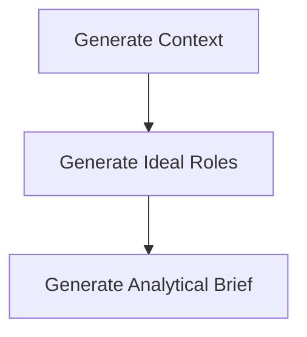
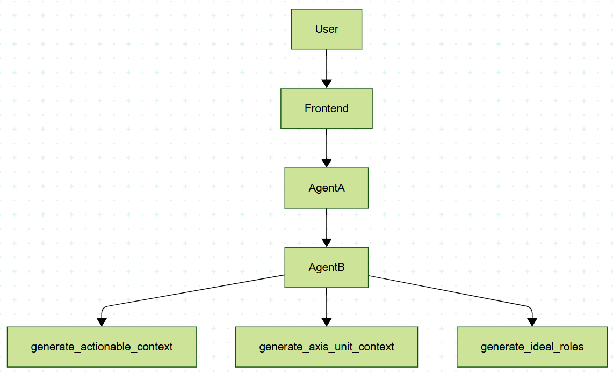

# 🚀 BIG — Business Idea Generator (Agentic AI Pipeline)

**AI-Powered, Multi-Agent, High‑Structure Strategic Analysis Pipeline**

Welcome to **BIG**, a production‑grade Agentic AI system designed to:

- Generate **deep strategic analytical contexts**
- Derive **ideal AI analytical roles**
- Produce **rigorous, cross‑cutting analysis briefs**
- Support **external orchestration** through a FastAPI endpoint
- Store full run artefacts and **dynamic execution graphs**
- Enable UX‑friendly tracing, logging, and reproducibility

---

# 🌐 Overview

BIG is built to serve as a **core intelligence module** inside larger multi‑agent systems.  
It consumes two inputs:

- **AXIS_OF_EXPLORATION**
- **UNIT_OF_ANALYSIS**

And produces a **3‑stage pipeline output**:

1. **General Context Block**
2. **Ideal Roles Prompt Opening**
3. **Actionable Analytical Context Brief**

The system also:

- Logs each sub‑step
- Saves all outputs on disk
- Generates a dynamic **Mermaid diagram** of the internal call flow

---

# 🧩 Architecture

```
FastAPI → Pipeline Executor → ReAct Agent → Tools → LLM
```

## Main Components

### **1. FastAPI Layer (`app/api.py`)**

Allows external services to call:

```
POST /run
```

with:

```json
{
  "axis": "Market Opportunities in Football",
  "unit": "Digital Fan Engagement Platforms",
  "ideal_roles": 7
}
```

It returns:

- The final output (step 3)
- The folder path where artefacts are stored
- The Mermaid diagram of execution

---

### **2. Core Pipeline (`app/main.py`)**

Handles:

- Settings loading
- Folder creation
- Step-by-step execution
- Tool invocation
- Run logging
- Graph capturing

Stages:

1. **generate_axis_unit_context**
2. **generate_ideal_roles**
3. **generate_actionable_context_brief**

All steps are tools wrapped by the graph tracer.

---

### **3. Tools (`app/agents/tools.py`)**

#### Tool 1 — Generate General Context

Produces:

```
-- START OF GENERAL CONTEXT --
(...)
-- END OF GENERAL CONTEXT --
```

#### Tool 2 — Generate Ideal Roles

Produces openings like:

```
You will embody the following roles to analyse <theme>:
1. **Role 1** — ...
2. **Role 2** — ...
(...)
```

#### Tool 3 — Generate Analytical Context Brief

Produces a **10‑section structured analysis** with:

- Neutral summary
- Definitions
- Observable signals
- Value chain table
- Needs segmentation
- JTBD
- Risks + unknowns
- Safeguards
- Traceability log

---

### **4. Dynamic Execution Graph (`app/graph_tracer.py`)**

Automatically produces:



The graph updates **automatically** when new steps/tools are added.

---

### **5. Config System (`app/config/settings.py`)**

Everything controlled via `.env`:

```env
AXIS_OF_EXPLORATION="DEMOGRAPHIC CHANGES"
UNIT_OF_ANALYSIS="POPULATION OVER 75 YEARS"
COUNTRY="USA"
EXTERNAL_RESEARCH="true"
IDEAL_ROLES=7
OUTPUT_BASE_DIR="runs"
```

Pydantic settings allow:

- Validation
- Defaults
- Auto-loading from `.env`

---

# 📦 Installation & Setup

## 1. Clone the project

```bash
git clone <your-repo-url>
cd big-agentic
```

## 2. Create virtual environment

```bash
python -m venv .venv
source .venv/bin/activate   # macOS/Linux
.venv\Scripts\activate    # Windows
```

## 3. Install requirements

```bash
pip install -r requirements.txt
```

## 4. Copy `.env.example` → `.env`

```bash
cp .env.example .env
```

Adjust values and API keys.

---

# ▶️ Run FastAPI Server

```bash
uvicorn app.api:app --reload
```

API Endpoints:

- `GET /` → Health check
- `POST /run` → Execute pipeline

---

# 🧪 Example POST Request

```bash
curl -X POST http://127.0.0.1:8000/run -H "Content-Type: application/json" -d '{
  "axis": "Market Opportunities in Football",
  "unit": "Youth Academies",
  "ideal_roles": 5
}'
```

Response:

```json
{
  "step1_general_context": "...",
  "step2_ideal_roles": "...",
  "step3_actionable_brief": "...",
  "execution_graph_mermaid": "graph TD ...",
  "run_folder": "runs/20251124_213231__axis-market-opportunities..."
}
```

---

# 📁 Output Structure

Each run is saved under:

```
runs/
  20251124_213231__axis-xxx__unit-yyy/
      step1_context.md
      step2_roles.md
      step3_brief.md
      execution_graph.mmd
      settings.json
```

---

# 🧠 Design Principles

### 🔹 Rigorous

Clear structure, GTM‑ready context, no hallucinated numbers.

### 🔹 Modular

Tools are atomic; the pipeline is swappable.

### 🔹 Dynamic

Graph auto-updates. Outputs versioned.

### 🔹 Observable

Each step logged, saved, traced.

---

# 🛠 Add Your Own Tools

Just create a new tool:

```python
@tool
def my_new_tool(x: str) -> str:
    return f"Processed: {x}"
```

Register it in:

- `main.py`
- `graph_tracer.py` (auto handles tracing)

It will automatically appear in the Mermaid graph.

---

# 🔮 Roadmap

- 🧩 Add memory (short-term / long-term)
- 🧠 Add evaluation agent
- 🧪 Add unit tests
- 🏗 Add business‑idea generation step
- 🌐 Deploy FastAPI on cloud

---

# © BIG — 2025

Designed for scalable, multi‑agent strategic reasoning.

# BIG – ReAct Agentic Scaffold

This is a minimal but extensible scaffold for a **ReAct Agentic AI application** using:

- [LangChain](https://python.langchain.com/)
- [LangGraph](https://langchain-ai.github.io/langgraph/)
- Tools & sub‑agents
- Typed state
- Config + logging driven by `.env`

For now, the application performs **two sequential sub‑agent steps**:

1. Generate a _general analytical context_ for:
   - `AXIS_OF_EXPLORATION`
   - `UNIT_OF_ANALYSIS`
2. Using that context, generate an _"ideal roles" prompt opening_ as described in your specification.

The program then prints the step‑2 result and exits.

---

## 1. Create and activate a virtualenv

From the folder that _contains_ this project (i.e. the parent of `big_react_agent/`):

```bash
python -m venv .venv
# On macOS/Linux:
source .venv/bin/activate
# On Windows (PowerShell):
.venv\Scripts\Activate.ps1
```

Upgrade pip (recommended):

```bash
python -m pip install --upgrade pip
```

---

## 2. Install dependencies

```bash
cd big_react_agent
pip install -r requirements.txt
```

---

## 3. Environment variables

Copy the example file and fill in your own API keys / settings:

```bash
cp .env.example .env
```

Then edit `.env` and set at least:

- `OPENAI_API_KEY`

You can also adjust:

- `AXIS_OF_EXPLORATION`
- `UNIT_OF_ANALYSIS`
- `IDEAL_ROLES`
- `LOG_LEVEL`
- etc.

> **Security note:** never commit your real keys to source control.

---

## 4. Run the application (Standalone)

From the project root:

```bash
python -m app.main
```

You should see logging output and finally something like:

```text
=== Final output ===

You will embody the following roles to analyse demographic changes:
1. ...
...
```

---

## 5. Project structure

```text
big_react_agent/
  README.md
  requirements.txt
  .env.example
  app/
    __init__.py
    main.py
    logging_config.py
    config/
      __init__.py
      settings.py
      loader.py
    agents/
      __init__.py
      base.py
      tools.py
    prompts/
      __init__.py
      coordinator.py
```

- `app/main.py` – entry point; wires settings, logging, LLM, agent and runs a single ReAct episode.
- `config/` – loading `.env` and mapping them into a `Settings` object.
- `logging_config.py` – small helper to configure Python logging from settings.
- `agents/` – ReAct agent scaffold and two sub‑agents implemented as tools.
- `prompts/` – coordinator prompt factory that injects `.env` values.

This is intentionally simple but structured enough to extend with:

- more tools / sub‑agents
- LangGraph flows
- external search tools
- persistent memory, DB, etc.

### BACKEND A

cd "C:\Users\MagnodaSilvaLeite(t2\Documents\Magno_Personal\AI\Portfolio\langgraph_ai_big_deep_agents_A/backend"
uvicorn app.main:app --reload --host 127.0.0.1 --port 8001

### FRONTEND A

cd "C:\Users\MagnodaSilvaLeite(t2\Documents\Magno_Personal\AI\Portfolio\langgraph_ai_big_deep_agents_A/frontend"
.venv/Scripts/Activate
python manage.py runserver 8002
Quit the server with CTRL-BREAK.

### BACKEND B

cd "C:\Users\MagnodaSilvaLeite(t2\Documents\Magno_Personal\AI\Portfolio\langgraph_ai_big_deep_agents_B"
uvicorn app.api:app --reload



## MERMAID

config:
look: classic
theme: forest

---

flowchart TB
User["User"] --> Frontend["Frontend"]
Frontend --> AgentA["AgentA"]
AgentA --> AgentB["AgentB"]
AgentB --> generate_actionable_context["generate_actionable_context"] & generate_axis_unit_context["generate_axis_unit_context"] & generate_ideal_roles["generate_ideal_roles"]
